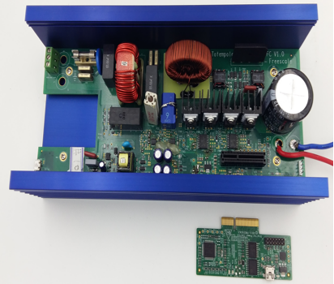

# NXP Application Code Hub

## DRM174: Totem-pole power factor correction based on mc56f8xxxx
This is a totem-pole bridgeless power factor correction reference design using MC56F8xxxx DSC.

The 56F8xxxx microcontroller is a member of the 32-bit 56800EX core-based Digital Signal Controllers (DSCs). Each device in the family combines, on a single chip, the processing power of a 32-bit DSP and the functionality of a microcontroller with a flexible set of peripherals. Due to its cost-effectiveness, configuration flexibility, and compact program code, 56F8xxxx is well-suited for many consumers and industrial applications.

Please refer to [DRM174](https://www.nxp.com/webapp/sps/download/preDownload.jsp?render=true) for complete instructions on how to use this software. 

 

#### Boards: Custom Board
#### Categories: Power conversion
#### Peripherals: ADC, CLOCKS, FLASH, GPIO, PWM, TIMER, UART
#### Toolchains: CodeWarrior

## Table of Contents
1. [Software](#step1)
2. [Hardware](#step2)
3. [Setup](#step3)
4. [Results](#step4)
5. [FAQs](#step5) 
6. [Support](#step6)
7. [Release Notes](#step7)

## 1. Software
The software for this Application Note is delivered in raw source files and CodeWarrior projects. There are three projects based on different control cards.
- Download and install [CodeWarrior 11.1](https://www.nxp.com/design/software/development-software/codewarrior-development-tools/codewarrior-legacy/codewarrior-for-mcus-eclipse-ide-coldfire-56800-e-dsc-qorivva-56xx-rs08-s08-s12z-11-1:CW-MCU10) and [CodeWarrior for MCU 11.1 Update 4](https://www.nxp.com/design/software/development-software/codewarrior-development-tools/codewarrior-legacy/codewarrior-for-mcus-eclipse-ide-coldfire-56800-e-dsc-qorivva-56xx-rs08-s08-s12z-11-1:CW-MCU10). 
- Download and install the latest version of [FreeMASTER](https://www.nxp.com/freemaster).

## 2. Hardware
* Power board: [Totem-Pole Bridgeless PFC Converter Main Board](https://www.nxp.com/design/designs/totem-pole-bridgeless-pfc-converter:RDPFC56F82748) Rev V1.1
* Control card: [HVP-56F81768](https://www.nxp.com/part/HVP-56F81768#/) Rev A or [HVP-56F82748](https://www.nxp.com/part/HVP-56F82748#/) Rev Aor [HVP-56F83783](https://www.nxp.com/part/HVP-56F83783#/) Rev A

## 3. Setup
* Download the firmware to the control chip by connecting a debugger (P&E-Multilink) to SWD port of the control board using a 14-pin cable.
* Plug in the control card, connect the input voltage and load to setup the development enviroment. If you want to control and monitor the working status of the system, using FreeMaster by connecting the micro interface on the control card to the PC through a micro USB cable.
* Input power on, then the system starts working.

## 4. Results
A programmable AC source, **Chroma, model 61704**, is used as AC voltage input for below tests.
* Power factor under full load is around 0.99 and THDi is around 3%.
* Peak frequency is greater than 98%.

## 5. FAQs
**5.1 How to control the on/off the converter?**

A control variable PFC_RUN is defined in the project to control the switch of the converter. When PFC_RUN=1, the converter is allowed to run. When PFC_RUN=0, the converter stops working. PFC_RUN can be modified by FreeMaster.

**5.2 How does the PFC connect to the post-stage DCDC to work?**

- Connect the PFC output to the subsequent DCDC input.
- Connect the communication port. J9 on the PFC board is a reserved UART communication port for communication with the subsequent DCDC.

**5.3 How to use FreeMASTER to control the system?**

Get a basic idea of FreeMASTER with [FreeMASTER User Guide](https://www.nxp.com/docs/en/user-guide/FMSTERUG.pdf). Go to [NXP community FreeMASTER Support Portal](https://community.nxp.com/t5/FreeMASTER/bd-p/freemaster) or [FreeMASTER landing page](https://www.nxp.com/freemaster) for more information if desired.
## 6. Support
#### Project Metadata
<!----- Boards ----->

<!----- Categories ----->

<!----- Peripherals ----->
      

<!----- Toolchains ----->

Questions regarding the content/correctness of this example can be entered as Issues within this GitHub repository.

>**Warning**: For more general technical questions regarding NXP Microcontrollers and the difference in expected funcionality, enter your questions on the [NXP Community Forum](https://community.nxp.com/)

## 7. Release Notes
| Version | Description / Update                           | Date                        |
|:-------:|------------------------------------------------|----------------------------:|
| 1.0     | Initial release on Application Code HUb        | June 14th 2023 |

